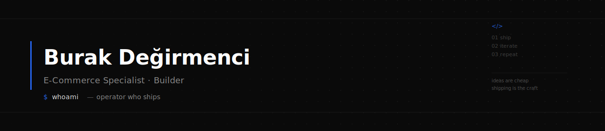

<div align="center">



<p>
  <a href="https://burakdegirmenci.me"></a>
  <a href="https://www.linkedin.com/in/burak-degirmenci/"></a>
  <a href="https://github.com/burakdegirmenci?tab=followers"></a>
</p>

</div>

---

##  About

```ts
const burak = {
  role: "E-Commerce Specialist · Builder",
  location: "Türkiye",
  background: "Software-educated, running e-commerce operations for a living",

  whatIDo: {
    day:   "E-commerce operations, growth, CRO",
    night: "Shipping AI-assisted tools that fix the operational pain I feel",
    craft: "Vibe coding — turning ideas into working software with AI as copilot",
  },

  currentlyExploring: [
    "AI agents embedded in e-commerce workflows",
    "Ticimax ecosystem tooling (MCP servers, feed generators, admin tools)",
    "Self-hosted Chatwoot for customer support automation",
    "Generative AI for fashion & retail (virtual try-on, catalog generation)",
  ],

  stack: {
    comfortable: ["TypeScript", "C# / .NET", "Python", "Node.js"],
    exploring:   ["Ruby on Rails", "Go"],
    infra:       ["Docker", "Hetzner", "Coolify", "Cloudflare"],
    aiTools:     ["Claude Code", "Cursor", "Gemini", "Imagen"],
  },

  philosophy: "Operator who ships. Every tool I build solves a problem I actually have.",
};
```

<details>
<summary>🇹🇷 Türkçe</summary>

Yazılım kökenli e-ticaret operatörüyüm. Gündüz e-ticaret operasyonu, büyüme ve CRO üzerine çalışıyorum; geceleri yaşadığım operasyonel sorunları çözen AI destekli araçlar geliştiriyorum. Ticimax ekosistemi için MCP sunucuları, feed üretici ve admin araçları; moda/perakende için üretken AI (sanal deneme, katalog üretimi); müşteri desteği otomasyonu için self-hosted Chatwoot üzerinde deneyler yapıyorum. Felsefem: fikir ucuz, asıl zanaat shipping.

</details>

---

##  Currently Building

Active work — some public, some private until ready.

- **StudioFit AI** — Generative AI app for the fitness space, built entirely on Google's stack (Imagen 4, Gemini 2.5 Flash, Virtual Try-On API). *Private, in progress.*
- **Ticimax MCP Server** — Full-coverage Model Context Protocol server wrapping Ticimax SOAP APIs (237 tools across 4 services) so LLMs can operate on a real e-commerce backend. *Private.*
- **E-Commerce AI Dashboard** — Multi-module ASP.NET Core 8 dashboard with AI-powered SEO generator, smart sorting, auto categorization, CRM and sales analytics. *Private.*
- **Chatwoot (self-hosted)** — Running the enterprise build on private infra for customer support automation and LLM integration experiments.

---

##  Public Experiments

<table>
<tr>
<td width="50%" valign="top">

**[ticimax-meta-feed-generator](https://github.com/burakdegirmenci/ticimax-meta-feed-generator)**
<br/>


<br/><br/>
Meta (Facebook) catalog XML feed generator for Ticimax stores. Clean Architecture implementation.

</td>
<td width="50%" valign="top">

**[galeri-yonetimi](https://github.com/burakdegirmenci/galeri-yonetimi)**
<br/>

<br/><br/>
Gallery management system — admin UI for uploading, organizing and publishing product/category imagery.

</td>
</tr>
<tr>
<td width="50%" valign="top">

**[elleshoes-url-shorter](https://github.com/burakdegirmenci/elleshoes-url-shorter)**
<br/>

<br/><br/>
Branded URL shortener — custom short links for campaign tracking and social posts.

</td>
<td width="50%" valign="top">

**[FeedApp](https://github.com/burakdegirmenci/FeedApp)**
<br/>

<br/><br/>
Product feed utility — transforms e-commerce catalog data into channel-specific feed formats.

</td>
</tr>
<tr>
<td width="50%" valign="top">

**[ProWidget](https://github.com/burakdegirmenci/ProWidget)**
<br/>

<br/><br/>
Embeddable web widget — drop-in JS component for product showcases on third-party sites.

</td>
<td width="50%" valign="top">&nbsp;</td>
</tr>
</table>

---

##  Tech Stack

**Languages**
<br/>


**Infra & Cloud**
<br/>


**AI Tools**
<br/>


---

##  Writing

Turkish notes on **e-commerce, AI and digital growth** at **[burakdegirmenci.me](https://burakdegirmenci.me)** — CRO, SEO, AI workflows, and how a solo operator can move faster with LLMs.

**Latest posts:**

<!-- BLOG-POST-LIST:START -->- [GEO &lpar;Üretken Motor Optimizasyonu&rpar; Rehberi: 2026’da AI Yanıtlarında Nasıl Yer Alınır?](https://burakdegirmenci.me/geo-uretken-motor-optimizasyonu-rehberi-2026da-ai-yanitlarinda-nasil-yer-alinir/) <sub>— Feb 23, 2026</sub>- [Terk Edilen Sepet İçin E-mail Remarketing Stratejileri](https://burakdegirmenci.me/terk-edilen-sepet-icin-e-mail-remarketing-stratejileri/) <sub>— Feb 9, 2026</sub>- [Sepet Terk Etmeyi Azaltan UX İyileştirmeleri](https://burakdegirmenci.me/sepet-terk-etmeyi-azaltan-ux-iyilestirmeleri/) <sub>— Feb 9, 2026</sub>- [Ürün Sayfasında Satış Getiren “Güven Öğeleri” Nelerdir?](https://burakdegirmenci.me/urun-sayfasinda-satis-getiren-guven-ogeleri-nelerdir/) <sub>— Feb 9, 2026</sub>- [E-Ticaret Operasyonunda KPI Seti Nasıl Kurulur?](https://burakdegirmenci.me/e-ticaret-operasyonunda-kpi-seti-nasil-kurulur/) <sub>— Feb 9, 2026</sub><!-- BLOG-POST-LIST:END -->

---

##  Contact

- Website — **[burakdegirmenci.me](https://burakdegirmenci.me)**
- LinkedIn — **[burak-degirmenci](https://www.linkedin.com/in/burak-degirmenci/)**

<div align="center">

<sub><i>"Ideas are cheap. Shipping is the craft."</i></sub>

</div>
